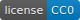

[](LICENSE.txt)

# Projet IS : "RobotIS"

Principalement inspiré du jeu en ligne multijoueurs [Robostrike](http://www.robostrike.com/) (2001) lui même imaginé à partir du jeu de société [RoboRally](https://fr.wikipedia.org/wiki/RoboRally/) (1994), RobotIS permet d'alier action et stratégie.

## Règles du jeu

Lors d’une manche, les joueurs choisissent six actions ordonnées (avancer, reculer, droite, gauche, attaquer, …) avant la fin du temps imparti. Une fois que les joueurs ont tous entré leurs ordres ou que le temps est écoulé, le jeu exécute les actions des joueurs tour par tour. 
Les manches s’enchaînent jusqu’à la victoire finale de l’un des joueurs. Le gagnant est le joueur qui atteint le premier tous les objectifs ou qui est le dernier survivant.
A l’exception du départ, plusieurs joueurs ne peuvent pas se trouver sur la même case. Si deux joueurs se retrouvent sur une même case, une collision a lieu et le joueur présent initialement sur la case disputée se fait pousser sur une case adjacente.

### Déplacements

Les déplacements de base sont : avancer, reculer, quart de tour à droite et quart de tour à gauche. A cela s'ajoute le boost, qui combiné à une action de déplacement vers le haut, le bas, la droite ou la gauche permet de sauter un nombre de cases égal au nombre de boost mis à la suite. Le robot reste immobilisé sur place pendant le chargement du boost et effectue le saut lors de l'action de déplacement suivant le ou les boosts. 

### Attaques

Chaque joueur commence la partie avec cinq points de vie et toute attaque entraîne la perte d’un point de vie pour le joueur touché.

### Bonus

Les joueurs obtiennent des bonus tels que des soins, des pièges ou des améliorations d’attaque en passant sur des cases bonus.


## Installation

### Linux

Procédure de compilation :

```
cd plt/build
cmake -DBUILD_CODE_COVERAGE=OFF ..
make
```
Procédure d'exécution :

```
../bin/client <argument>
```
Les arguments sont : hello, state, render, engine, random_ai
Pour jouer (en solo) : utiliser l'argument "engine".
Pour observer un robot jouer tout seul : utiliser l'argument "AI".

### Windows

En cours

```
sutdown -0
```

### Mac OS

En cours

```
En cours
```


## Sources

* [C++](https://en.wikipedia.org/wiki/C++) - Programmation en C++
* [Serveur](https://maven.apache.org/) - Apache 5.2
